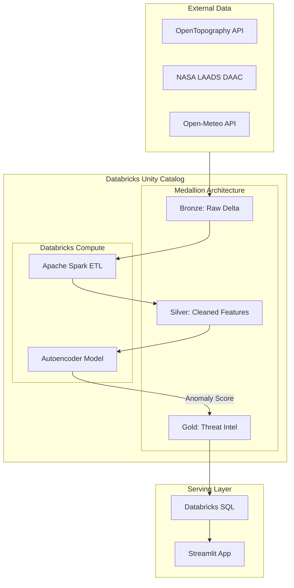
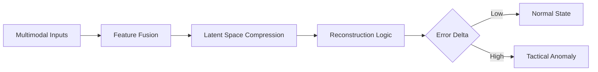

Bharat-Guard-Anti-Infiltration-in-Kashmir
Bharat Guard: A tactical AI system on Databricks securing 75 border sectors. It fuses real-time weather, terrain metrics, and NLP-processed OSINT. Features a Deep Learning Autoencoder for anomaly detection, identifying high-risk infiltration and environmental threats in J&K by correlating sensor data with AI-extracted intelligence.

What it does:
Bharat Guard is a tactical intelligence platform that monitors 75 hexagonal border sectors by fusing real-time environmental sensors with AI-processed news alerts. It uses a Deep Learning Autoencoder to detect security and terrain anomalies, providing a unified risk score for border surveillance.
### 🛡️ Technical Architecture
This diagram illustrates the end-to-end data pipeline within the Databricks Lakehouse, governed by Unity Catalog and following the Medallion Architecture.

🛡️ Bharat Guard: Theoretical Architecture I. The Multi-Source Ingestion Layer (The Sensors) The system operates on a Multimodal Data Fusion theory. It assumes that no single data source is sufficient for border security. Instead, it correlates:

Topographical Constant: Elevation and slope data (static) that define natural infiltration corridors.

Satellite Variables: NASA spectral data (dynamic) to detect heat signatures or changes in ground cover.

Meteorological Variables: High-resolution weather data (dynamic) that affects visibility and sensor performance.

II. The Medallion Data Evolution (The Logic) We follow the Medallion Data Theory to transform raw noise into tactical intelligence:

Bronze (Raw): Preservation of historical state (immutable).

Silver (Feature Space): Normalization and Spatial Join. Here, disparate APIs are unified into a single Feature Vector representing one of the 75 tactical hexagons.

Gold (Decision Space): The final output where raw data is converted into a Threat Index (0-1).

III. The Neural Anomaly Detection Theory (The Brain) Instead of using supervised learning (which requires labeled "attack" data that is rare), Bharat Guard uses an Autoencoder Neural Network.

Encoding: The model compresses the 75-hex feature vector into a lower-dimensional Latent Space, capturing the "normal" environmental signature of the border.

Decoding: The model attempts to reconstruct the original input from this compressed state.

The Theory of Reconstruction Error: If the model receives input it has never seen before (e.g., a sudden thermal spike in a high-slope area during a fog event), it will fail to reconstruct it accurately. This High Reconstruction Error is theoretically defined as a Tactical Anomaly.

IV. The Governance & Serving Theory (The Interface) The architecture is wrapped in Unity Catalog, which ensures Data Lineage—meaning every threat score in the Gold layer can be traced back to the exact NASA or Weather packet that triggered it. This provides "Explainable AI" for tactical commanders.

